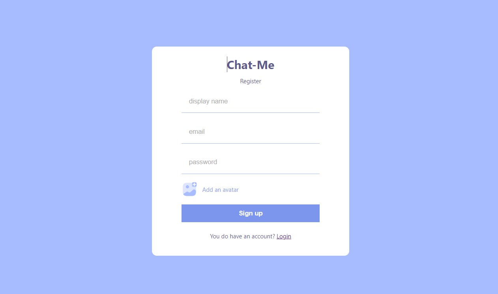
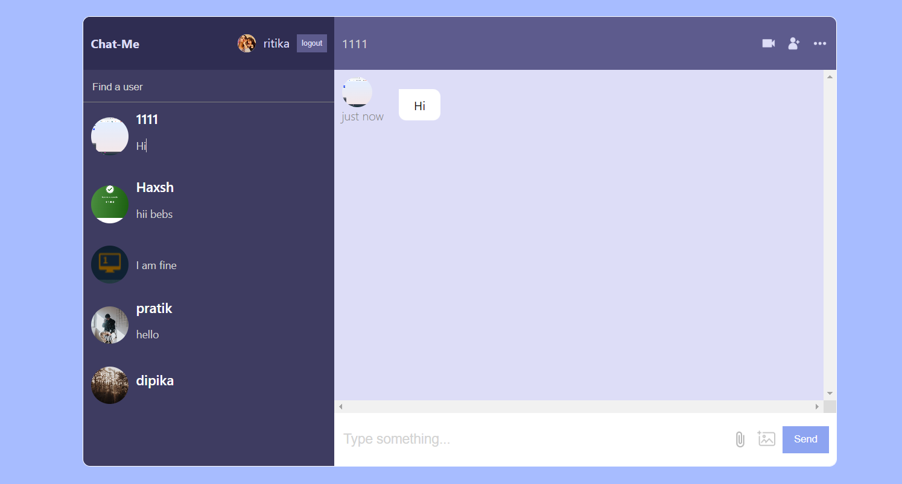
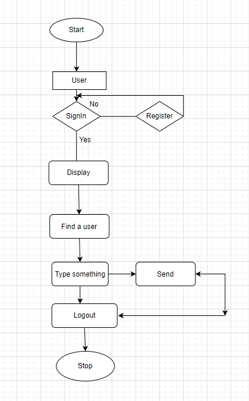

# Chat-Me

# project-documentation

  

  

<h3 align="center">Chat-Me</h3>

---

## 📝 Table of Contents
- [About](#about)
- [Getting Started](#getting_started)
- [Usage](#usage)
- [Flow Chart](#flowchart)
- [Authors](#authors)
- [Acknowledgments](#acknowledgement)

## 🧐 About 
 A chat application is a software program that allows users to communicate with each other in real-time through text-based messages, either one-on-one or in groups. Users typically create an account, add contacts or join channels, and can then send and receive messages, as well as share files and media. Many chat applications also offer additional features such as voice and video calls, emojis, and other forms of multimedia. Examples of popular chat applications include WhatsApp, Facebook Messenger, and Slack.

## 🏁 Getting Started 
These instructions will get you a copy of the project up and running on your local machine for development and testing purposes. See [deployment](#deployment) for notes on how to deploy the project on a live system.

### Prerequisites
What things you need to install the software and how to install them.

we have install 

1) VS Code
2) Node js
3) React
4) Firebase

### Installing
A step by step series of examples that tell you how to get a development env running.

## how to VS Code.

1)You can install Visual Studio Code (VS Code) by following these steps:

2)Go to the official Visual Studio Code website at https://code.visualstudio.com/
Click on the "Download for Windows" button if you're using a Windows computer, or the "Download for Mac" button if you're using a Mac.
3)Once the download is complete, double-click on the downloaded file to start the installation process.

4)Follow the installation wizard prompts to install VS Code on your computer. You can choose the default settings or customize them to your preferences.

5)Once the installation is complete, you can launch VS Code by double-clicking on the application icon.

## how to install node js.
Go to the official Node.js website at https://nodejs.org/.
Click on the "Download" button for the recommended version for your operating system.
Once the download is complete, double-click on the downloaded file to start the installation process.
Follow the installation wizard prompts to install Node.js on your computer. You can choose the default settings or customize them to your preferences.
Once the installation is complete, open your terminal or command prompt and type "node -v" to verify that Node.js is installed correctly. You should see the version number of Node.js printed in the terminal.
Alternatively, if you prefer to install Node.js using a package manager, you can find instructions for your specific operating system on the Node.js website.

## how to install React.
You can install React by following these steps:

1) Install Node.js on your computer, as React requires Node.js to run.
2) Open your terminal or command prompt and navigate to the directory where you want to create your React project.
3) Run the following command to create a new React project:

* npx create-react-app Chat-me
Replace "Chat-me" with the name of your project.

4) Once the command completes, navigate into your project directory by running:
* cd Chat-me

5) Start the development server by running:
* npm start

This will start a local development server that you can access by navigating to http://localhost:3000 in your web browser.

That's it! React should now be installed and running on your computer. You can start building your React application by editing the source files in the "src" directory of your project.

## how to install Firebase
To install Firebase in your project, you can follow these steps:

1) Make sure you have Node.js installed on your computer. Firebase requires Node.js to run.

2)Open your project directory in your terminal or command prompt.

3) Run the following command to install the Firebase SDK for your platform:
* npm install firebase

4) Once the installation is complete, you can import Firebase in your project code by adding the following line:
import firebase from 'firebase/app';
import 'firebase/auth';
import 'firebase/database';

5) Initialize Firebase in your project code by adding the following code:
const firebaseConfig = {
  // Your Firebase project configuration
};

firebase.initializeApp(firebaseConfig);

That's it! You now have Firebase installed and set up in your project, and you can start using its various features and services. Note that you'll need to replace "your Firebase project configuration" in the above code with your actual Firebase project configuration, which you can find in the Firebase console.

## 🔧 Running the tests 
## 🎈 Usage 

Add notes about how to use the system.

* process of run the project on your system are as follow :

1) Install Node.js on your computer if you haven't already done so.

2) Create a new React project using the create-react-app command-line tool:
* npx create-react-app chat-me

3) Navigate to the project directory
* cd Chat-me

4)Install the Firebase JavaScript SDK:
* npm install firebase

5) Create a new Firebase project or select an existing project from the Firebase console.

6) Enable the Firebase Realtime Database and Firebase Authentication services in your project.

7) Create a new web app in your Firebase project by clicking on the "Add app" button in the Firebase console.

8) Copy the Firebase configuration settings for your web app.

9) Create a new file named firebase.js in the src directory of your React project.

10) Paste the Firebase configuration settings into firebase.js and export them as a JavaScript object:
import firebase from 'firebase/app';
import 'firebase/database';
import 'firebase/auth';

const firebaseConfig = {
  // Your Firebase project configuration
};

firebase.initializeApp(firebaseConfig);

export default firebase;

11) Start the React development server:
* npm start

## ⛏️ Flow Chart 

- [HTML,CSS,JAVASCRIPT,REACT] - Front-end
- [FIREBASE] - Back-end

## ✍️ Authors 
This project develped in a group of two person:-

1)shivani kashyap
Link:- https://github.com/shivanikashyap1032

2)prit shah
Link:- https://github.com/prit2810

## 🎉 Acknowledgements 
- Hat tip to anyone whose code was used

1) As an student, I do not copy code from specific individuals or sources. Instead, I generate responses based on the algorithms and models trained on a vast corpus of data. However, it is always good practice to acknowledge the work of others if you have used their code or ideas in your own work. This helps to give credit where it's due and to avoid plagiarism. So, if you have used someone else's code, it is important to cite the source and give proper attribution.

- Inspiration

1)Create a real-time chat application that allows users to communicate with each other in a fun and interactive way. Use React to build a responsive front-end interface and Firebase's real-time database to provide instant updates on message delivery. Implement user authentication to ensure secure communication, and add support for emojis and image sharing to make the chat experience more engaging. With these features, you can create a chat application that users will love to use!

- References

Here are some references that can help you get started with building a chat application using React and Firebase:

1)Firebase documentation: The Firebase documentation is an excellent resource for learning how to use Firebase's real-time database and authentication features. You can find the documentation here: https://firebase.google.com/docs.

2)React documentation: The React documentation is also an essential resource for learning how to build a React application. You can find the documentation here: https://reactjs.org/docs/getting-started.html.

3)React Firebase Chat Application Tutorial: This tutorial walks you through building a chat application using React, Firebase, and Material-UI. You can find the tutorial here: https://www.positronx.io/build-react-firebase-chat-app-tutorial/.

